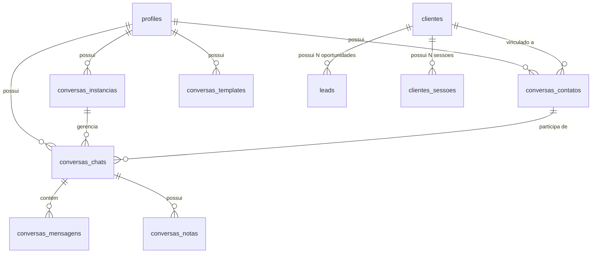
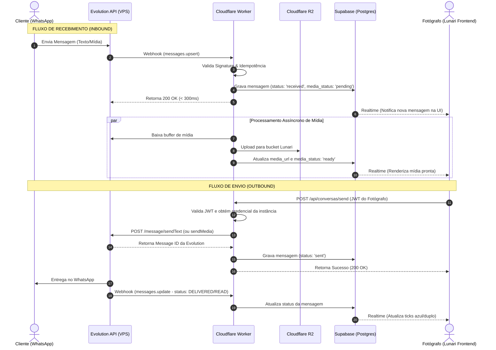

# Arquitetura do Módulo de Conversas — Lunari

**Documento de Arquitetura e Decisões Técnicas**  
**Versão:** 1.1 · **Status:** Revisão Técnica Concluída — Pronto para Validação da Fase 0  
**Referência Oficial do Repositório**

---

## 1. Objetivo do Módulo

O módulo **Conversas** é a central operacional e de comunicação do Lunari, conectando o estúdio fotográfico aos seus clientes via WhatsApp (através da Evolution API).

**O que o módulo É:**
- A interface de comunicação unificada do fotógrafo dentro do Lunari.
- Uma camada operacional inteligente que identifica com quem o fotógrafo fala.
- Um painel contextual que agrega dados de Leads, Clientes, Workflow, Orçamentos e Financeiro.
- Um executor de ações rápidas (inserir orçamento, agendar sessão, alterar etapa do funil, registrar pagamento).
- Uma interface responsiva no padrão três painéis (desktop) e fluxos dedicados (mobile).

**O que o módulo NÃO É:**
- **NÃO é um novo CRM:** `clientes` continua sendo a única base de contatos cadastrados.
- **NÃO é um novo sistema de Leads:** `leads` e `lead_statuses` continuam sendo a única fonte de verdade comercial.
- **NÃO é um novo Workflow:** `clientes_sessoes` continua sendo a única fonte de verdade das sessões.
- **NÃO é um novo Financeiro:** `fin_transactions` e `cobrancas` continuam sendo a única fonte de verdade financeira.
- **NÃO é um novo sistema de Orçamentos:** `commercial_materials` e `material_shares` continuam sendo a única fonte de propostas.
- **NÃO é um sistema de Gallery:** nenhuma tela ou bloco de gerenciamento de seleção/entrega de fotos existirá dentro de Conversas.

---

## 2. Princípios Arquiteturais e Regras Fundamentais

1. **"MENSAGEM NÃO É LEAD":**
   Receber uma mensagem pelo WhatsApp **nunca** cria um Lead automaticamente. Mensagem é apenas tráfego de comunicação. A criação de oportunidade comercial é um ato consciente ou resultado de uma regra de contexto estrita.
2. **"CONTATO PODE SER CRIADO AUTOMATICAMENTE":**
   Quando uma mensagem chega de um número inédito no WhatsApp, o sistema cria automaticamente o registro de contato de comunicação (`conversas_contatos`) e a thread da conversa (`conversas_chats`). Isso **NÃO** cria um Lead e **NÃO** cria um registro de Cliente no CRM com dados incompletos.
3. **Fonte Única de Verdade e Estado Único:**
   Não existem "status da conversa" e separadamente "status do lead" para a mesma etapa comercial. Se o fotógrafo altera a etapa do lead na conversa, a página Leads reflete instantaneamente; se alterar na página Leads, a conversa reflete instantaneamente.
4. **Desacoplamento e Determinismo na V1:**
   A versão 1.0/1.1 opera **100% sem IA**. O funcionamento básico, o motor de sugestões e o fluxo de atendimento são regidos por regras determinísticas claras. A IA ("Lu") será introduzida em etapas posteriores como camada desacoplada e sob demanda.
5. **Segurança de Borda e Defesa de Infraestrutura:**
   A Evolution API roda isolada na VPS (Contabo). Nenhum webhook atinge diretamente o banco de dados sem passar por validação e normalização em um Cloudflare Worker. As credenciais da Evolution API jamais são expostas ao frontend.
6. **Mídia Fora do Banco e Fora do Supabase Storage:**
   Todas as mídias trafegadas no WhatsApp (áudios, fotos, vídeos, documentos) são salvas diretamente no **Cloudflare R2** via Worker assíncrono. O banco armazena exclusivamente URLs públicas/assinadas e metadados.

---

## 3. Arquitetura Atual Relevante do Lunari

A investigação técnica do repositório revelou as seguintes estruturas ativas:
- **Frontend:** React 18, Vite, TypeScript, Tailwind CSS, Radix UI / shadcn/ui. Gerenciamento de estado global via Context API (`AppContext`, `WorkflowCacheContext`, `ConfigurationContext`).
- **PWA & Cache:** Service Worker gerenciado com Workbox. Regra crítica imutável: chunks dinâmicos pesados não entram no precache (`globIgnores` em `vite.config.ts`).
- **Banco de Dados:** Supabase (PostgreSQL 15) com Row Level Security (RLS) habilitado em 100% das tabelas de negócio.
- **Modelo de Usuários/Segurança:** O Lunari opera no modelo de isolamento por fotógrafo/usuário: `auth.uid() = user_id`. Não há tabelas ativas de multi-tenancy/equipes compartilhadas; tabelas globais utilizam `has_role(auth.uid(), 'admin')`.
- **Storage:** O projeto utiliza **Cloudflare R2** abstraído pelo módulo `src/lib/gestaoR2Upload.ts` e hook `src/hooks/useR2Upload.ts`. Contextos existentes: `avatar`, `logo`, `blog`, `form`, `task`, `client-document`, `contrato-assinado`, `proposals-pdf`, `general`.
- **Backend Edge / Workers:** Diretórios `workers/` e `edge-workers/` utilizam Cloudflare Workers para processamento de borda e I/O intensivo.
- **Realtime:** Supabase Realtime (WebSockets) utilizado em conjunto com `BroadcastChannel` no frontend (ex: `WorkflowCacheContext`).

---

## 4. Estruturas Existentes que Serão Reutilizadas

| Estrutura Existente | Tabela / Módulo | Como Conversas Reutiliza |
|---|---|---|
| **Clientes** | `clientes`, `clientes_familia` | Vinculação do contato do WhatsApp ao perfil cadastral completo do cliente. |
| **Leads** | `leads`, `lead_statuses` | Exibição e alteração da etapa comercial no painel da conversa; vinculação de múltiplas oportunidades. |
| **Config Follow-up** | `lead_follow_up_config` | Utilização das regras de dias e prazos configurados pelo usuário para follow-up. |
| **Workflow / Sessões** | `clientes_sessoes`, `etapas` | Exibição de sessões agendadas, status do fluxo de trabalho e atalhos de preparação. |
| **Orçamentos** | `commercial_materials`, `material_shares` | Listagem de propostas ativas do cliente e geração de links de compartilhamento direto no chat. |
| **Financeiro** | `fin_transactions`, `cobrancas` | Cálculo do resumo financeiro (Total Contratado, Pago, Saldo Devedor) e geração de link de cobrança. |
| **Storage R2** | `gestaoR2Upload.ts` | Armazenamento de mídias recebidas e enviadas no WhatsApp. |
| **Design System** | `src/components/ui/*` | Componentes visuais consistentes (Button, Dialog, Sheet, Dropdown, Badge, Tooltip). |

---

## 5. Estruturas que Precisarão Ser Modificadas

1. **`src/lib/gestaoR2Upload.ts`:**
   - Adicionar o contexto `'whatsapp-media'` ao tipo `R2Context` para suportar o isolamento e políticas de retenção de mídias de chat.
2. **`leads` (Consistência de Múltiplos Vínculos):**
   - Garantir índices de performance para consultas por `cliente_id` e `whatsapp` normalizado: `idx_leads_cliente_id_status`.
3. **`Workflow / Gallery Redirects`:**
   - Adaptação na tela de Workflow e Gallery para incluir a ação: "Enviar via Conversas", direcionando para `/app/conversas?cliente_id=...&action=send_gallery`.

---

## 6. Avaliação Técnica: Entidade "Conversa" vs "Contato"

> [!IMPORTANT]
> **Decisão Arquitetural — Entidade Conversa Desacoplada**  
> Avaliou-se o modelo inicial `conversas_contatos -> conversas_mensagens` contra um modelo desacoplado `conversas_contatos -> conversas_chats -> conversas_mensagens`.  
> **Decisão:** Adotar a entidade explícita **`conversas_chats` (Conversa/Thread)** separada de **`conversas_contatos` (Pessoa/Identidade)**.

### Justificativa Técnica:
1. **Separação de Domínios:** Um contato é uma entidade física (telefone, nome, avatar, vínculo com CRM `clientes`). Uma conversa é uma thread de comunicação (instância, JID do chat, contagem de não lidas, última mensagem, fixada, arquivada).
2. **Grupos no WhatsApp (Evolução Futura):** Embora grupos de WhatsApp estejam **explicitamente fora do escopo inicial**, o modelo `conversas_contatos -> conversas_mensagens` tornaria impossível suportar grupos no futuro sem uma migração destrutiva. Com `conversas_chats`, um chat pode ser do tipo `individual` ou `group`.
3. **Múltiplas Instâncias:** Se o estúdio possuir dois números conectados no futuro, o mesmo contato poderá ter threads separadas por instância sem colisão de contadores de não lidas.

---

## 7. Modelo de Dados Proposto (Supabase / Postgres)

Todas as tabelas seguem o padrão de segurança Lunari: RLS ativado com política `auth.uid() = user_id`.



### 7.1 Tabela `conversas_instancias`
Representa a conexão do WhatsApp via Evolution API.
- `id` (UUID, PK, `gen_random_uuid()`)
- `user_id` (UUID, NOT NULL, FK `auth.users(id) ON DELETE CASCADE`)
- `instance_name` (TEXT, NOT NULL, UNIQUE por usuário) — Nome da instância na Evolution
- `status` (TEXT, NOT NULL, DEFAULT `'disconnected'`) — `'connecting' | 'connected' | 'disconnected'`
- `phone_number` (TEXT, NULL) — Número conectado
- `profile_name` (TEXT, NULL)
- `profile_picture_url` (TEXT, NULL)
- `qrcode` (TEXT, NULL) — Base64 efêmero durante conexão
- `created_at` (TIMESTAMPTZ, DEFAULT `now()`)
- `updated_at` (TIMESTAMPTZ, DEFAULT `now()`)
- *Nota de Segurança:* O token de autenticação da Evolution API **NÃO é gravado nesta tabela acessível ao frontend**. Veja Seção 18.

### 7.2 Tabela `conversas_contatos`
Representa a identidade da pessoa no WhatsApp e seu mapeamento para o CRM.
- `id` (UUID, PK, `gen_random_uuid()`)
- `user_id` (UUID, NOT NULL, FK `auth.users(id) ON DELETE CASCADE`)
- `cliente_id` (UUID, NULL, FK `clientes(id) ON DELETE SET NULL`) — Vínculo com cliente do Lunari
- `whatsapp_jid` (TEXT, NOT NULL) — Ex: `551199999999@s.whatsapp.net`
- `phone_raw` (TEXT, NOT NULL) — Número exatamente como enviado pela Evolution
- `phone_normalized` (TEXT, NOT NULL) — Apenas números, canônico (E.164)
- `nome_whatsapp` (TEXT, NULL) — Push name informado pelo WhatsApp
- `nome_personalizado` (TEXT, NULL) — Sobrescrita manual feita pelo fotógrafo
- `avatar_url` (TEXT, NULL)
- `created_at` (TIMESTAMPTZ, DEFAULT `now()`)
- `updated_at` (TIMESTAMPTZ, DEFAULT `now()`)
- *Índices:* `UNIQUE(user_id, whatsapp_jid)`, `INDEX(user_id, phone_normalized)`, `INDEX(user_id, cliente_id)`.

### 7.3 Tabela `conversas_chats`
Representa a thread de comunicação (a conversa em si).
- `id` (UUID, PK, `gen_random_uuid()`)
- `user_id` (UUID, NOT NULL, FK `auth.users(id) ON DELETE CASCADE`)
- `instancia_id` (UUID, NOT NULL, FK `conversas_instancias(id) ON DELETE CASCADE`)
- `contato_id` (UUID, NOT NULL, FK `conversas_contatos(id) ON DELETE CASCADE`)
- `chat_jid` (TEXT, NOT NULL) — JID do chat
- `tipo` (TEXT, NOT NULL, DEFAULT `'individual'`) — `'individual' | 'group'` (grupos reservados para o futuro)
- `unread_count` (INTEGER, NOT NULL, DEFAULT 0)
- `last_message_content` (TEXT, NULL)
- `last_message_type` (TEXT, NULL) — `'text' | 'image' | 'audio' | 'video' | 'document'`
- `last_message_at` (TIMESTAMPTZ, NULL)
- `last_message_direction` (TEXT, NULL) — `'inbound' | 'outbound'`
- `is_archived` (BOOLEAN, NOT NULL, DEFAULT `false`)
- `is_pinned` (BOOLEAN, NOT NULL, DEFAULT `false`)
- `created_at` (TIMESTAMPTZ, DEFAULT `now()`)
- `updated_at` (TIMESTAMPTZ, DEFAULT `now()`)
- *Índices:* `UNIQUE(user_id, instancia_id, chat_jid)`, `INDEX(user_id, last_message_at DESC)`, `INDEX(user_id, unread_count)`.

### 7.4 Tabela `conversas_mensagens`
Histórico de mensagens da conversa.
- `id` (UUID, PK, `gen_random_uuid()`)
- `user_id` (UUID, NOT NULL, FK `auth.users(id) ON DELETE CASCADE`)
- `chat_id` (UUID, NOT NULL, FK `conversas_chats(id) ON DELETE CASCADE`)
- `evolution_msg_id` (TEXT, NOT NULL) — ID único da mensagem gerado pelo WhatsApp
- `direction` (TEXT, NOT NULL) — `'inbound' | 'outbound'`
- `type` (TEXT, NOT NULL) — `'text' | 'image' | 'audio' | 'video' | 'document' | 'sticker' | 'other'`
- `content` (TEXT, NULL) — Texto ou legenda da mídia
- `media_url` (TEXT, NULL) — URL da mídia no Cloudflare R2
- `media_mime_type` (TEXT, NULL)
- `media_size_bytes` (BIGINT, NULL)
- `media_status` (TEXT, NOT NULL, DEFAULT `'none'`) — `'none' | 'pending_upload' | 'ready' | 'error'`
- `status` (TEXT, NOT NULL, DEFAULT `'sent'`) — `'pending' | 'sent' | 'delivered' | 'read' | 'failed'`
- `error_message` (TEXT, NULL)
- `sent_at` (TIMESTAMPTZ, NOT NULL)
- `created_at` (TIMESTAMPTZ, DEFAULT `now()`)
- *Índices:* `UNIQUE(user_id, evolution_msg_id)` *(Garante Idempotência)*, `INDEX(chat_id, sent_at ASC)`.

### 7.5 Tabela `conversas_notas`
Notas internas do fotógrafo sobre o contato ou conversa (não enviadas ao cliente).
- `id` (UUID, PK, `gen_random_uuid()`)
- `user_id` (UUID, NOT NULL, FK `auth.users(id) ON DELETE CASCADE`)
- `chat_id` (UUID, NOT NULL, FK `conversas_chats(id) ON DELETE CASCADE`)
- `contato_id` (UUID, NOT NULL, FK `conversas_contatos(id) ON DELETE CASCADE`)
- `content` (TEXT, NOT NULL)
- `created_at` (TIMESTAMPTZ, DEFAULT `now()`)
- `updated_at` (TIMESTAMPTZ, DEFAULT `now()`)
- *Índices:* `INDEX(chat_id, created_at DESC)`.

### 7.6 Tabela `conversas_templates`
Modelos de mensagem de resposta rápida com variáveis.
- `id` (UUID, PK, `gen_random_uuid()`)
- `user_id` (UUID, NOT NULL, FK `auth.users(id) ON DELETE CASCADE`)
- `categoria` (TEXT, NOT NULL) — `'primeiro_atendimento' | 'apresentacao' | 'orcamento' | 'follow_up' | 'confirmacao' | 'lembrete' | 'pos_sessao' | 'entrega' | 'pagamento' | 'pos_venda' | 'outro'`
- `titulo` (TEXT, NOT NULL)
- `conteudo` (TEXT, NOT NULL)
- `atalho` (TEXT, NULL) — Ex: `orcamento_natal` (ativado via `/`)
- `ordem` (INTEGER, NOT NULL, DEFAULT 0)
- `created_at` (TIMESTAMPTZ, DEFAULT `now()`)
- `updated_at` (TIMESTAMPTZ, DEFAULT `now()`)
- *Índices:* `INDEX(user_id, categoria)`.

---

## 8. Relacionamentos entre Domínios

```
[conversas_contatos] ── (1:1 opcional) ── [clientes]
                                              │
                   ┌──────────────────────────┼──────────────────────────┐
                   ▼                          ▼                          ▼
               [leads]               [clientes_sessoes]           [fin_transactions]
        (N oportunidades ao longo          (Workflow)              & [cobrancas]
                do tempo)                     │                          │
                   │                          ▼                          ▼
                   │                  [galerias] (Gallery)       (Saldo devedor)
                   ▼                          │
         [commercial_materials]              │ (Apenas redirecionamento)
           & [material_shares] ───────────────┘
```

- **Contato ↔ Cliente:** A vinculação é opcional. Se o contato for novo, ele existe em `conversas_contatos` sem `cliente_id`. Ao criar ou associar a um cliente, o ID é registrado.
- **Cliente ↔ Leads (Oportunidades):** Um cliente pode ter múltiplos leads associados ao longo da vida (`cliente_id` em `leads`). O painel direito de Conversas sempre prioriza a oportunidade ativa mais recente, mas permite visualizar o histórico.
- **Cliente ↔ Sessões:** A conversa busca as sessões em `clientes_sessoes` filtrando por `cliente_id` para expor próximas datas e status de produção.

---

## 9. Fluxo de Eventos da Evolution API (Recebimento e Envio)



---

## 10. Webhooks, Eventos e Idempotência

### 10.1 Eventos Processados pela Evolution API
1. `MESSAGES_UPSERT`: Nova mensagem recebida ou enviada fora da plataforma.
2. `MESSAGES_UPDATE`: Atualização de status da mensagem (`DELIVERY_ACK`, `READ`, `PLAYED`).
3. `CONNECTION_UPDATE`: Estado de conexão da instância (`open`, `close`, `connecting`).
4. `QRCODE_UPDATED`: Novo QR code gerado para pareamento.

### 10.2 Estratégia Estrita de Idempotência
- A Evolution API pode reenviar o mesmo webhook em falhas transitórias de rede.
- Chave de idempotência: `UNIQUE(user_id, evolution_msg_id)`.
- No Worker: Executar `INSERT ... ON CONFLICT (user_id, evolution_msg_id) DO NOTHING` para mensagens recebidas.
- Para atualizações de status: Somente atualizar se a transição for para frente (`sent` -> `delivered` -> `read`). Nunca regredir status.

---

## 11. Identificação, Deduplicação e Telefones Brasileiros

### 11.1 O Desafio dos Telefones no Brasil
- Telefones brasileiros possuem variações críticas:
  - Presença ou ausência do nono dígito em celulares (DDI 55 + DDD 2 dígitos + 8 ou 9 dígitos).
  - WhatsApp JIDs históricos criados antes do nono dígito continuam usando o formato antigo de 8 dígitos (ex: `551188887777@s.whatsapp.net`), mesmo que o número físico do usuário seja `5511988887777`.
  - Máscaras diversas cadastradas manualmente no CRM: `(11) 98888-7777`, `11988887777`, `+55 11 98888-7777`.

### 11.2 Regras de Normalização
1. **`phone_raw`:** Mantém a string exata recebida.
2. **`phone_normalized` (Algoritmo Canônico):**
   - Remove todos os caracteres não numéricos (`\D`).
   - Se começar com `0`, remove o `0`.
   - Se não tiver DDI `55`, adiciona `55`.
   - Extrai DDI (55) e DDD (2 dígitos).
   - Se for celular (DDD 11 a 99) e tiver 8 dígitos após o DDD, gera a variante canônica com 9 dígitos prefixando `9`.
3. **Busca Flexível de Duplicidade no CRM:**
   - Ao buscar um cliente correspondente em `clientes.telefone` ou `clientes.whatsapp`:
     O sistema gera as duas variantes (com e sem o 9º dígito) e executa busca indexada:
     ```sql
     WHERE regexp_replace(telefone, '\D', '', 'g') IN (var_com_9, var_sem_9)
        OR regexp_replace(whatsapp, '\D', '', 'g') IN (var_com_9, var_sem_9)
     ```
4. **Regra de Não-Destruição:**
   Encontrar correspondência no CRM **NUNCA** altera o campo `telefone` original do cliente cadastrado. Apenas preenche `conversas_contatos.cliente_id`.

---

## 12. Regras de Negócio: Identificação e Criação de Leads

> [!IMPORTANT]
> **A Matriz dos 8 Sinais Contextuais**  
> Antes de sugerir ou criar uma oportunidade comercial, o sistema avalia obrigatoriamente a matriz:

| # | Sinal Contextual | Análise Determinística | Impacto na Decisão |
|---|---|---|---|
| 1 | **Quem é a pessoa?** | Verifica se o número já tem `conversas_contatos`. | Novo contato tem alta propensão a novo interesse. |
| 2 | **Existe cliente correspondente?** | Busca em `clientes` via telefone normalizado. | Se existe cliente, oportunidade deve ser atrelada a ele (sem duplicar pessoa). |
| 3 | **Existe Lead aberto?** | Busca em `leads` onde `status` NOT IN (Fechado, Perdido). | Se já existe lead aberto, mensagem é **continuidade da negociação** (não cria novo lead). |
| 4 | **Tempo desde último contato** | Intervalo entre a última mensagem/sessão e o evento atual. | Janela configurável (ver Seção 13). Curto = continuidade; Longo = reengajamento. |
| 5 | **Existe sessão ativa?** | Busca em `clientes_sessoes` com data >= hoje ou status ativo. | Forte indicador de suporte operacional pós-venda/pré-ensaio. |
| 6 | **Existe serviço/contrato ativo?** | Relacionamento ativo no estúdio. | Atenção para distinguir dúvida sobre serviço atual vs pedido de novo serviço. |
| 7 | **Oportunidade comercial aberta?** | Orçamento enviado recentemente sem fechamento. | Continuidade de follow-up do orçamento existente. |
| 8 | **Intenção comercial expressa?** | Detecção de padrões e termos comerciais na mensagem. | Fator determinante para sugerir abertura de novo lead. |

### Exemplos de Intenção Comercial Determinística:
- Expressões de Preço: `"quanto custa"`, `"qual o valor"`, `"tabela de preços"`, `"preço"`, `"orçamento"`.
- Expressões de Disponibilidade: `"tem data"`, `"disponibilidade"`, `"agenda para"`, `"tem horário"`.
- Expressões de Serviços/Ensaios: `"ensaio de natal"`, `"gestante"`, `"newborn"`, `"casamento"`, `"acompanhamento"`.
- Expressões de Contratação: `"quero fechar"`, `"como faço para agendar"`, `"pacotes"`.

### Regra de Reabertura e Múltiplas Oportunidades
- O fato de alguém já ser cliente no Lunari **não significa que nunca mais será Lead**.
- Exemplo Real: Cliente "Mariana Silva" fez Ensaio Gestante há 10 meses (Lead 1: Fechado; Sessão: Concluída). Mariana envia: *"Oi! Queria saber como funciona o ensaio de Natal."*
  - **Decisão:** Cliente existente reconhecida. Sessão de gestante concluída no passado. Nova intenção comercial detectada. O sistema sugere criar **Nova Oportunidade: Natal** vinculada à mesma Mariana Silva.

---

## 13. Tempo Desde o Último Contato e Sessão Ativa

### 13.1 O Tempo como Sinal Relativo
- **Nenhum valor fixo de dias é hardcoded sem justificativa.**
- A janela de inatividade utiliza como referência a configuração em `lead_follow_up_config` do próprio usuário (padrão de mercado: 30 a 60 dias para considerar um ciclo comercial reaberto).
- **Tempo sozinho NUNCA cria Lead.** Tempo é um peso de ponderação.

### 13.2 Regra de Conflito com Sessão Ativa
- Se o cliente possui sessão de "Parto/Newborn" agendada para semana que vem e pergunta: *"Posso levar minha mãe no estúdio?"*:
  - Sessão ativa detectada + ausência de termos de novo serviço = **Atendimento Operacional**. Nenhum lead é sugerido.
- Se o mesmo cliente com sessão de Newborn pergunta: *"Vocês também fazem fotos corporativas para meu marido?"*:
  - Sessão ativa detectada + intenção comercial para novo nicho detectada = **Nova Oportunidade Sugerida**.

---

## 14. Integração com Leads — Fonte Única de Verdade

- Conversas **NÃO possui** campos como `conversation_pipeline_stage` ou `conversation_status`.
- O card de status exibido no cabeçalho ou painel direito da conversa lê diretamente de:
  `leads.status` (referenciando `lead_statuses.name` e `lead_statuses.color`).
- **Sincronização Bidirecional Obrigatória:**
  - Se o fotógrafo arrasta o card no Kanban da página `/app/leads`, o status exibido na conversa atualiza em tempo real.
  - Se o fotógrafo clica em "Mudar etapa para: Orçamento Enviado" no painel da conversa, o registro correspondente em `leads` é atualizado e o Kanban da página `/app/leads` reflete sem necessidade de recarregar a página.

---

## 15. Follow-up: Regras, Prazos e Invalidação

### 15.1 Ciclo de Vida do Follow-up
1. **Gatilho de Início:** Lead na etapa `"Orçamento Enviado"` (ou proposta compartilhada via `material_shares`).
2. **Cálculo de Prazo:** Lê `lead_follow_up_config.days_after_quote` (ou padrão de 2 a 3 dias úteis).
3. **Condição de Pendência:**
   - Última mensagem na conversa foi `outbound` (enviada pelo fotógrafo).
   - `now() - last_message_at >= prazo_configurado`.
   - Lead ainda não foi marcado como Fechado ou Perdido.
4. **Invalidação Automática:**
   - Se o cliente responder (`inbound`) a qualquer momento, o status de follow-up pendente é **imediatamente invalidado/removido**, pois o cliente já retomou a conversa.
5. **Comportamento na V1.1:**
   - Nenhuma mensagem de follow-up é disparada automaticamente.
   - O painel direito destaca a tag `"Follow-up Pendente"`, exibe o template sugerido de acompanhamento e o fotógrafo clica para inserir e enviar manualmente.

---

## 16. Templates de Mensagens

O sistema oferece duas modalidades de uso:

### Modalidade A: Acesso Manual pelo Fotógrafo
- **Gatilho de Teclado:** Digitar `/` no campo de texto abre o popover de templates filtráveis por atalho.
- **Gaveta de Templates:** Ícone de documento ao lado do botão de envio abre lista categorizada.

### Modalidade B: Sugestão Contextual Automática
- O motor de regras identifica a etapa e o conteúdo e renderiza o template relevante diretamente no Painel Direito.

### Substituição de Variáveis Suportadas:
- `{nome}`: Primeiro nome do cliente ou push name do WhatsApp.
- `{categoria}`: Nome da categoria do ensaio em negociação.
- `{data}`: Data da próxima sessão agendada (se houver).
- `{horario}`: Horário da próxima sessão (se houver).
- `{link_orcamento}`: Link público da proposta ativa (`material_shares.token`).
- `{link_cobranca}`: Link de pagamento ativo (`cobrancas.payment_url`).
- `{nome_estudio}`: Nome configurado no perfil do fotógrafo.

*Regra de Ouro:* Clicar em um template **NUNCA envia diretamente**. O texto é inserido no campo de digitação para revisão e edição pelo fotógrafo.

---

## 17. Motor de Sugestões Contextuais (Sem IA)

O motor roda no frontend/borda avaliando uma matriz multicritério:

```
ENTRADAS DO MOTOR:
  ├─ Contato (Novo vs Cliente Cadastrado)
  ├─ Lead Ativo (Existe? Qual a etapa?)
  ├─ Sessão Ativa (Existe? Próxima data?)
  ├─ Orçamento Aberto (Existe? Compartilhado?)
  ├─ Última Mensagem (Direção: Inbound/Outbound | Timestamp)
  └─ Padrões de Texto (Keywords comerciais)
                 │
                 ▼
     [MATRIZ DETERMINÍSTICA]
                 │
                 ▼
SAÍDA: 1 a 3 Sugestões Prioritárias (Templates ou Ações Rápidas)
```

### Exemplos da Matriz de Decisão:
1. **Caso Contato Inédito + Pergunta de Preço:**
   - Sugestão 1: Ação rápida `[Criar Lead]`
   - Sugestão 2: Template `[Primeiro Atendimento]`
   - Sugestão 3: Template `[Apresentação do Estúdio]`
2. **Caso Lead com Orçamento Enviado + Sem resposta há > 48h:**
   - Sugestão 1: Template `[Follow-up de Orçamento]`
   - Sugestão 2: Ação rápida `[Reenviar Link da Proposta]`
   - Sugestão 3: Ação rápida `[Marcar como Perdido]`
3. **Caso Cliente com Sessão Agendada para amanhã:**
   - Sugestão 1: Template `[Lembrete e Orientações de Ensaio]`
   - Sugestão 2: Ação rápida `[Ver Detalhes do Workflow]`

---

## 18. Segurança, Isolamento e Credenciais da Evolution API

> [!CAUTION]
> **Proteção Crítica de Credenciais**  
> As credenciais da Evolution API (`EVOLUTION_API_URL` e `EVOLUTION_API_KEY`) conferem poder total sobre instâncias e sessões. Elas **NUNCA** devem residir em tabelas com permissão de SELECT para usuários anônimos ou autenticados.

### Estrutura de Armazenamento Seguro:
1. **Secrets Globais da VPS/Evolution:** Armazenadas exclusivamente como **Cloudflare Worker Secrets** (`wrangler secret put EVOLUTION_API_KEY`).
2. **Tokens de Instância Específica:**
   - Se gerados por instância, são armazenados em uma tabela interna `conversas_instancias_segredos` com **RLS DESABILITADO PARA O FRONTEND** (acessível exclusivamente via Supabase Service Role pelo Cloudflare Worker).
3. **Comunicação do Frontend:**
   - O frontend dispara requisições para a rota segura do Worker: `POST /api/conversas/send`.
   - O Worker valida o JWT do usuário (`auth.uid()`), verifica se o usuário é dono da instância solicitada, anexa a credencial protegida e faz o forward para a Evolution API.

---

## 19. Armazenamento de Mídias (Cloudflare R2)

- O WhatsApp trafega arquivos volumosos (áudios `.ogg`, fotos `.jpeg`, comprovantes `.pdf`, vídeos).
- **Desoneração do Webhook:** O Worker não segura o webhook da Evolution enquanto faz upload de arquivos pesados. O webhook responde 200 OK imediatamente e enfileira o download/upload via `ctx.waitUntil()`.
- **Bucket R2:** Diretório estruturado `conversas/{user_id}/{chat_id}/{year}/{month}/{msg_id}_{filename}`.
- **Política de Retenção (Fase Futura):** Cron de expurgo ou lifecycle rule no R2 para mídias recebidas com mais de 180 dias sem interação, preservando textos e metadados no banco.

---

## 20. Realtime e Sincronização da Interface

- **Canais Supabase Realtime:**
  1. `conversas_chats:user_id=eq.{uid}`: Atualiza badge de não lidas, trecho da última mensagem e reordena a lista lateral sem recarregar.
  2. `conversas_mensagens:chat_id=eq.{active_chat_id}`: Recebe novas mensagens inseridas no chat ativo e atualiza status de leitura/entrega instantaneamente.
- **Otimismo na Interface:**
  - Mensagens enviadas pelo fotógrafo aparecem imediatamente no chat com ícone de relógio (`status: 'pending'`).
  - Após confirmação do Worker/Evolution, o status comuta para `sent` (1 tick cinza).
  - O webhook da Evolution notifica via Realtime a transição para `delivered` (2 ticks cinzas) e `read` (2 ticks azuis).

---

## 21. Painel Direito: Dois Estados e Ações Rápidas

O painel direito da interface de desktop (e drawer no mobile) divide-se em dois estados:

### 21.1 Estado Normal (Foco Operacional Leve)
- Bloco de **Sugestões Contextuais** (1 a 3 cards acionáveis).
- Bloco de **Templates Rápidos**.
- Bloco de **Notas Internas da Conversa** (com adição rápida).
- Resumo do Lead atual (etapa comercial com dropdown para alteração imediata).
- Botão expansor: `[Ver Perfil Completo do Cliente →]`.

### 21.2 Estado Expandido (Visão 360° sem sair da conversa)
- **Dados Cadastrais:** Nome, telefone, aniversário, membros da família.
- **Pipeline de Vendas:** Histórico de oportunidades/leads da pessoa.
- **Próxima Sessão:** Data, pacote, local e atalho para abrir o Workflow completo.
- **Orçamentos:** Propostas criadas em `commercial_materials`, com botão `[Inserir no Chat]`.
- **Resumo Financeiro:** Total contratado, total pago e saldo devedor pendente, com botão `[Gerar Cobrança Link]`.
- **Atalhos Rápidos:** Abrir em Clientes, Abrir em Workflow, Abrir em Finanças.

---

## 22. Integração com Gallery (Regra Exclusiva)

- **Proibição:** Nenhum componente de gestão de fotos, visualização de grades de galeria, aprovação de fotos ou gerenciamento de downloads existirá em Conversas.
- **Fluxo Único Homologado:**
  1. O fotógrafo está no módulo **Gallery** ou no **Workflow** e clica em `"Compartilhar Galeria via WhatsApp"`.
  2. A aplicação redireciona para `/app/conversas?cliente_id={id}&action=share_gallery&gallery_id={id}`.
  3. A conversa do cliente é selecionada.
  4. O campo de composição é pré-preenchido com o template de entrega e o link da galeria (`gallery.lunarihub.com/...`).
  5. O fotógrafo revisa e clica em Enviar.

---

## 23. Futura Camada de IA ("Lu" — Sob Demanda)

> [!NOTE]
> A IA **não faz parte da Fase 1**. Sua arquitetura está desacoplada e reservada para o momento apropriado.

- **Ativação Estritamente Sob Demanda:** Botão `✦ Lu` na barra de ferramentas. A IA nunca analisa mensagens silenciosamente sem solicitação do usuário.
- **Fluxo de Decisão Assistida:**
  ```
  Mensagem do Cliente + Contexto do Lunari
               │
               ▼
     [Lu / Provedor de IA]
               │
               ▼
   Proposta Estruturada em JSON
               │
               ▼
  [Motor de Regras do Lunari]  <─── Valida permissões e coerência
               │
               ▼
  Apresentação na UI para o Fotógrafo Aprovar com 1 Clique
  ```
- **Invariante de Segurança:** A IA **NUNCA escreve diretamente no banco de dados**. Toda sugestão da Lu requer aprovação manual do fotógrafo ou validação do motor determinístico.

---

## 24. Limites e Invariantes Inegociáveis

1. `conversas_mensagens` é uma tabela de append-only (somente inserção e atualização de status de entrega). Nenhuma mensagem de cliente é editada ou excluída no banco.
2. A alteração de etapa de lead dentro de Conversas deve obrigatoriamente chamar a mesma função de serviço que a página `/app/leads` utiliza para garantir disparos de triggers e auditorias.
3. Não criar campos de telefone sem normalização. O `phone_normalized` é a única chave técnica de cruzamento com a base de clientes.
4. Nenhuma mídia pode ser servida diretamente da Evolution API para o frontend; o tráfego deve passar obrigatoriamente pelo Cloudflare R2 para garantir disponibilidade permanente.

---

## 25. Decisões Pendentes para a Fase 0

Antes de executar a primeira migration definitiva:
- [ ] **Definição da VPS:** Validar se a instância da Evolution API rodará em Docker Compose padrão na VPS Contabo existente e documentar a URL base de homologação.
- [ ] **Estratégia de Proxy Cloudflare para Webhooks:** Configurar rota no Cloudflare Worker para recepcionar webhooks da Evolution sob domínio `api.lunarihub.com` ou subdomínio dedicado.
- [ ] **Configuração de Permissão de Instâncias:** Definir se um estúdio poderá conectar múltiplos números na v1.1 ou se o limite será estritamente 1 instância por fotógrafo. (Recomendado para v1.1: 1 instância ativa por usuário).
