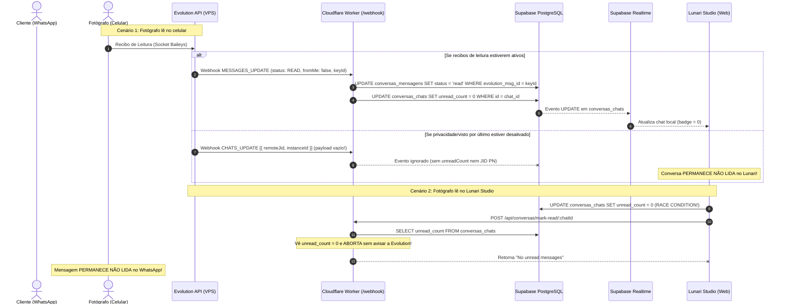
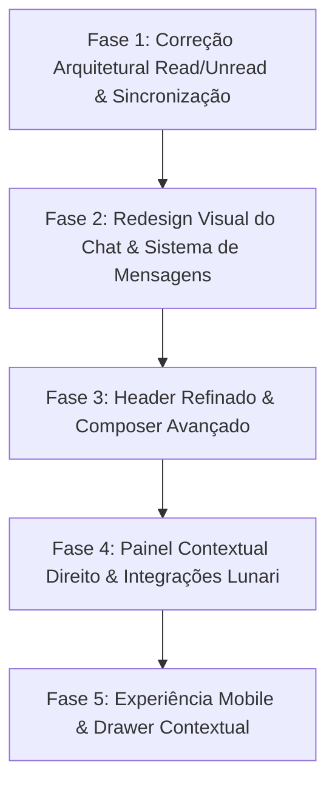

# Auditoria Técnica e Arquitetura Alvo — Módulo Conversas (Lunari Studio)

**Data da Auditoria:** 24 de Setembro de 2026  
**Status:** Auditoria e Diagnóstico Concluídos — Baseline para Implementação  
**Ambiente Auditado:** Frontend (React 18 + Vite), Backend Supabase (PostgreSQL 17), Cloudflare Worker (`edge-workers/api`), Evolution API v2.3.7  

---

## 1. Diagnóstico do Estado Atual

### 1.1 Frontend
- **Páginas e Roteamento:** O módulo é acessado via `/photographer/conversas`, envelopado por `src/components/conversas/chat/WhatsAppLayout.tsx`.
- **Sidebar & Lista:** `ChatListSidebar.tsx` e `ChatListItem.tsx`. Suporta busca textual em memória (nome, telefone, última mensagem), filtros estáticos (`Todas`, `Não lidas`, `Clientes`, `Leads`) derivados do array local `chats`, menu de contexto de 3 pontos (`...`) com ações de Fixar, Arquivar, Bloquear, Excluir e Marcar como lida/não lida.
- **Painel Central (Chat):** `ChatPanel.tsx`, `ChatHeader.tsx`, `MessageGroup.tsx`, `MessageBubble.tsx`. Virtualização com `@tanstack/react-virtual`, agrupamento por data (`DateDivider.tsx`), suporte a áudio (`AudioPlayer.tsx`), figurinhas (`useConversasStickers.ts`), reações com paleta flutuante, quotes/replies (`quoted_content`).
- **Composer:** `MessageComposer.tsx`, `AttachMenu.tsx`, gravação via `useAudioRecorder.ts`, atalho para biblioteca de áudios salvos (`AudiosSalvosLibrary.tsx`).
- **Estado Global e Hooks:**
  - `useConversasRealtime.ts`: gerencia a lista de chats, instâncias conectadas e subscriptions realtime para `conversas_chats`, `conversas_instancias` e `conversas_contatos`.
  - `useConversasChat.ts`: gerencia as mensagens do chat selecionado, paginação com sentinela (`IntersectionObserver`), envio de mensagens com estado otimista e subscription realtime para `conversas_mensagens`.
- **Painel Direito:** Inexistente no código atual.

---

### 1.2 Backend (Supabase PostgreSQL)
- **Tabelas Principais:**
  - `conversas_instancias`: Instâncias da Evolution API vinculadas ao fotógrafo (`user_id`).
  - `conversas_contatos`: Contatos normalizados (telefone no padrão E.164 com DDI +55).
  - `conversas_chats`: Threads de conversa ativas/arquivadas/bloqueadas por instância e contato.
  - `conversas_mensagens`: Mensagens com `evolution_msg_id` para idempotência, direção (`inbound`/`outbound`), tipo, mídia, status e timestamp.
  - `conversas_webhook_events`: Audit trail de eventos recebidos da Evolution API.
  - `conversas_notas`: Notas internas efêmeras por chat.
  - `conversas_stickers` e `conversas_audios_salvos`: Metadados de mídias reutilizáveis.
- **Triggers e RPCs:**
  - `trg_conversas_update_chat_last_message` (em `conversas_mensagens`): Atualiza `ultima_mensagem`, `ultima_mensagem_data`, `ultima_mensagem_type` e incrementa `unread_count` condicionalmente.
  - `conversas_increment_unread`: RPC legada (mantida após fix de double count em `20260913210000`).

---

### 1.3 Cloudflare Worker (`edge-workers/api`)
- **Rotas de Borda:**
  - `POST /api/conversas/webhook`: Ponto de entrada público para webhooks da Evolution API.
  - `POST /api/conversas/mark-read/:chatId`: Rota autenticada do usuário para enviar recibo de leitura à Evolution API.
  - `POST /api/conversas/mark-unread/:chatId`: Rota para forçar chat como não lido no WhatsApp via `/chat/markChatUnread`.
  - `POST /api/conversas/send-message`: Envio de mensagens e mídias via Evolution.
  - `POST /api/conversas/sync-chats`: Sincronização e fila de histórico de mensagens.

---

## 2. Inventário de Problemas Encontrados

| Categoria | Sintoma Observado | Causa Raiz Técnica | Impacto |
|---|---|---|---|
| **Arquitetura / Sync** | Conversa lida no celular continua com badge no Lunari | Recibos de leitura (`read`) dependem de privacidade do WhatsApp; Evolution v2.3.7 descarta payload de `CHATS_UPDATE`; inexistência de cursor temporal de leitura (`last_read_at`). | Alto (perda de confiança do usuário na lista de conversas) |
| **Arquitetura / Sync** | Mensagem enviada pelo estúdio não zera não lidas | O trigger `tg_conversas_update_chat_last_message` ignora mensagens `outbound`, mantendo o `unread_count` residual de mensagens inbound antigas. | Alto (chats respondidos continuam marcados como pendentes) |
| **Race Condition** | Leitura no Lunari não sincroniza com o celular | `useConversasChat.ts` zera `unread_count = 0` no banco antes de disparar o Worker; o Worker lê `unread_count === 0` e aborta sem chamar a Evolution API. | Alto (celular continua mostrando não lida) |
| **Bug de UX / UI** | Clicar em "Marcar como lida" no menu marca como não lida | `WhatsAppLayout.tsx` passa `onMarkUnread` para ambas as ações; nunca invoca `markAsRead`. | Médio (ação manual quebra expectativa) |
| **Visual / Layout** | Vão horizontal de mais de 1200px entre balões | O container de mensagens no `ChatPanel.tsx` usa 100% da largura da tela sem container de bloco centralizado nem max-width. | Alto (quebra estética e cansaço visual) |
| **Visual / DNA** | Balões outbound brancos ofuscantes em Dark Mode | `MessageBubble.tsx:331` usa `dark:bg-white text-[#1C1C1C]` para mensagens enviadas. | Alto (violação direta do Design DNA Lunari) |
| **Visual / Componentes** | Cards de documentos gigantescos e genéricos | Falta de componente padronizado com metadados estruturados (extensão, páginas, peso, download discreto). | Médio |
| **Produto** | Ausência do Painel de Contexto Direito | Não existe painel lateral com dados do cliente/lead, workflow, financeiro ou próximas sessões. | Alto (módulo opera como WhatsApp isolado) |
| **Mobile** | Navegação não possui fluxo Lista → Chat → Contexto | Telas mobile alternam apenas entre lista e chat sem ponto de entrada para contexto de negócio. | Médio |

---

## 3. Investigação Aprofundada: Leitura e Não Leitura (Read / Unread)

### 3.1 Anatomia da Cadeia de Eventos



---

### 3.2 O Dilema Conceitual: Estado da Mensagem vs. Cursor da Conversa

A investigação empírica no banco revelou:
1. Existem **2.921 mensagens inbound** no banco com `status = 'delivered'` pertencentes a conversas que possuem `unread_count = 0`.
2. Vários chats com a última mensagem enviada pelo estúdio (`direction = 'outbound'`) mantêm `unread_count > 0` (ex: chats `f05417f3`, `a1008af3`, `365685e1`).

#### Diagnóstico:
O Lunari hoje tenta tratar "não lida" como **estado de mensagem individual**, mas expõe na interface um contador numérico na conversa. Como mensagens recebidas nem sempre recebem recibos individuais da Evolution API (devido a privacidade do WhatsApp ou payloads vazios de `CHATS_UPDATE`), o contador fica órfão.

#### Solução Arquitetural Definitiva: **Cursor Temporal de Leitura (`last_read_at`)**
A conversa deve possuir um cursor temporal determinístico:
- `last_read_at TIMESTAMPTZ`: o timestamp exato do momento em que o estúdio leu a conversa (ou enviou uma mensagem nela).
- `last_inbound_at TIMESTAMPTZ`: o timestamp da última mensagem recebida do cliente.

Uma conversa é considerada **não lida** se e somente se:
$$\text{ultima\_mensagem\_direction} = \text{'inbound'} \quad \text{AND} \quad (\text{last\_read\_at IS NULL} \;\lor\; \text{ultima\_mensagem\_data} > \text{last\_read\_at})$$

Sempre que o estúdio envia uma mensagem (`outbound`), o cursor `last_read_at` avança automaticamente para o timestamp da mensagem, garantindo que qualquer resposta do fotógrafo zere imediatamente o estado de não lida.

---

## 4. Arquitetura Alvo

### 4.1 Modelo de Dados Aprimorado (Supabase)

```sql
-- Alterações na tabela conversas_chats
ALTER TABLE public.conversas_chats
  ADD COLUMN IF NOT EXISTS last_read_at TIMESTAMPTZ,
  ADD COLUMN IF NOT EXISTS last_inbound_at TIMESTAMPTZ,
  ADD COLUMN IF NOT EXISTS cliente_id UUID REFERENCES public.clientes(id) ON DELETE SET NULL,
  ADD COLUMN IF NOT EXISTS lead_id UUID REFERENCES public.leads(id) ON DELETE SET NULL;

-- Trigger aprimorado com cursor de leitura automático
CREATE OR REPLACE FUNCTION public.tg_conversas_update_chat_last_message()
RETURNS TRIGGER LANGUAGE plpgsql AS $$
DECLARE
  v_current_last_date TIMESTAMPTZ;
BEGIN
  SELECT ultima_mensagem_data INTO v_current_last_date
  FROM public.conversas_chats
  WHERE id = NEW.chat_id;

  IF v_current_last_date IS NULL OR NEW.timestamp >= v_current_last_date THEN
    UPDATE public.conversas_chats
    SET
      ultima_mensagem = NEW.content,
      ultima_mensagem_data = NEW.timestamp,
      ultima_mensagem_type = NEW.type,
      ultima_mensagem_direction = NEW.direction,
      last_inbound_at = CASE WHEN NEW.direction = 'inbound' THEN NEW.timestamp ELSE last_inbound_at END,
      -- Se a mensagem foi enviada pelo estúdio, avança o cursor de leitura e zera unread_count
      last_read_at = CASE WHEN NEW.direction = 'outbound' THEN NEW.timestamp ELSE last_read_at END,
      unread_count = CASE
        WHEN NEW.direction = 'outbound' THEN 0
        WHEN NEW.direction = 'inbound' AND conversas_chats.status = 'active' THEN conversas_chats.unread_count + 1
        ELSE conversas_chats.unread_count
      END,
      updated_at = now()
    WHERE id = NEW.chat_id;
  END IF;

  RETURN NEW;
END;$$;
```

---

### 4.2 Fluxo Unificado de `markAsRead`

1. **Frontend:** Invoca diretamente a rota do Worker `POST /api/conversas/mark-read/:chatId`.
2. **Worker:**
   - Não depende mais de `chat.unread_count > 0` para prosseguir.
   - Busca as mensagens inbound não lidas daquele chat (`direction = 'inbound' AND (last_read_at IS NULL OR timestamp > last_read_at)`).
   - Envia `markMessageAsRead` para a Evolution API com os IDs das mensagens.
   - Atualiza no Supabase:
     ```sql
     UPDATE conversas_chats
     SET unread_count = 0, last_read_at = now(), updated_at = now()
     WHERE id = p_chat_id;
     
     UPDATE conversas_mensagens
     SET status = 'read'
     WHERE chat_id = p_chat_id AND direction = 'inbound' AND status != 'read';
     ```
3. **Realtime:** Supabase emite evento de `UPDATE` com `unread_count: 0` e `last_read_at`. O frontend atualiza a UI sem race conditions.

---

## 5. Especificação do Painel Contextual Direito

O Painel Direito é a peça central que confere identidade do Lunari ao Conversas, transformando a conversa em uma central operacional sem burocracia.

```
┌────────────────────────────────────────────────────────┐
│ [Avatar] Ana Paula Silva                               │
│ [Badge: Lead] [Tag: Gestante]                          │
├────────────────────────────────────────────────────────┤
│ 💼 CONTEXTO COMERCIAL                                  │
│ Estágio: Orçamento Enviado                             │
│ Oportunidade: Ensaio Gestante 2026                     │
│ Valor: R$ 1.850,00                                     │
│ Origem: Instagram Direct                               │
│ Último contato: Há 2 dias                              │
├────────────────────────────────────────────────────────┤
│ ⚡ PRÓXIMO PASSO SUGERIDO                              │
│ 💡 Fazer Follow-up de Orçamento                        │
│ "Proposta visualizada há 48h sem resposta."            │
│ [Botão: Aplicar Template de Follow-up]                 │
├────────────────────────────────────────────────────────┤
│ 📅 SESSÕES / WORKFLOW                                  │
│ Nenhuma sessão ativa no momento                        │
│ [Botão: + Agendar Sessão]                              │
├────────────────────────────────────────────────────────┤
│ ⚡ AÇÕES RÁPIDAS LUNARI                                │
│ • Ver Cadastro Completo                                │
│ • Enviar Proposta / Orçamento                          │
│ • Criar Tarefa                                         │
│ • Notas Internas da Conversa                           │
└────────────────────────────────────────────────────────┘
```

### Fontes de Dados Existentes no Lunari para o Painel:
1. **Identificação e Contato:** `conversas_contatos.cliente_id` → tabela `clientes` (nome, email, telefone, categoria, data de nascimento).
2. **Leads / Comercial:** tabela `leads` (id, status, origem, valor estimado, tags, needs_follow_up, ultima_interacao).
3. **Workflow / Sessões:** tabela `clientes_sessoes` filtrada por `cliente_id` (data_sessao, hora_sessao, categoria, pacote, status, valor_total, valor_pago).
4. **Orçamentos:** tabelas `commercial_materials` e `material_shares` vinculadas ao cliente/lead.
5. **Financeiro:** tabela `fin_items_master` e `cobrancas` vinculadas ao cliente.
6. **Tarefas:** tabela `tasks` vinculada ao cliente ou lead.

### Regra Anti-CRM Burocrático:
- **Contato Novo $\neq$ Lead Automático:** Receber mensagem de número desconhecido gera apenas `conversas_contatos` (`tipo = 'unknown'`).
- A interface expõe botões claros: `[+ Criar Lead / Oportunidade]` ou `[+ Vincular a Cliente]`. O usuário tem controle consciente sobre o funil.

---

## 6. Sistema Visual & Redesign (DNA Lunari)

Comparação direta entre o estado auditado e as diretrizes visuais consolidadas:

### 6.1 Proporção Cromática Áurea
- **85% Neutros:**
  - *Light Mode:* Fundo `#F7F6F3` / `#F5F4F0`. Balões recebidos (`inbound`) em branco sólido (`bg-white`) com borda suave (`border-black/[0.04]`) e sombra dispersa.
  - *Dark Mode:* Fundo grafite profundo `#121212`. Balões recebidos em carvão elevado `#1E1E1E` com borda sutil `#282828`.
- **12% Preto Grafite / Carvão:**
  - *Light Mode:* Texto e cabeçalhos em `#1A1A1A`.
  - *Dark Mode:* Superfícies de apoio, sidebar em `#171717`.
- **3% Dourado Lunari (`hsl(var(--accent-gold))`):**
  - Balões enviados (`outbound`) em tom areia dourada elegante:
    - *Light:* `#F3EDE2` com texto `#1A1A1A`.
    - *Dark:* Carvão dourado sofisticado `#2A241C` (com borda sutil `#3D3324`), **nunca branco chapado**.
  - Acentos de status, ticks de leitura (`CheckCheck`), badges de destaque.

### 6.2 Ergonomia e Aproveitamento Espacial do Chat
- **Fim do Vão de 1200px:** A área de mensagens receberá um container com `max-w-4xl mx-auto w-full px-4` centralizado.
- **Hierarquia de Balões:**
  - Mensagens consecutivas do mesmo remetente com espaçamento compacto (`space-y-1`).
  - Troca de remetente com respiro (`space-y-3`).
  - Largura máxima do balão fixada em `max-w-[75%] sm:max-w-[65%]`.
- **Componentes Padronizados:**
  - *Documentos:* Card compacto com badge colorida de formato (PDF, DOC, XLS), nome legível, tamanho em KB/MB e botão discreto de download/preview.
  - *Áudios:* Player com avatar/ícone circular, waveform estilizado, minutagemmono-espaçada e controle de velocidade (`1x`, `1.5x`, `2x`).
  - *Mídia (Imagens/Vídeos):* Cantos arredondados consistentes (`rounded-xl`), sem molduras brancas artificiais.

---

## 7. Roadmap de Implementação em Fases Independentes



### Fase 1: Correção Arquitetural Read/Unread & Sincronização
- **Objetivo:** Estabelecer o cursor temporal de leitura (`last_read_at`), corrigir o trigger de mensagens outbound e eliminar a race condition de `markAsRead`.
- **Arquivos Envolvidos:**
  - `supabase/migrations/YYYYMMDD_conversas_reading_cursor.sql`
  - `edge-workers/api/src/routes/conversas-webhook.ts`
  - `edge-workers/api/src/routes/conversas-mark-read.ts`
  - `src/hooks/useConversasChat.ts`
  - `src/hooks/useConversasRealtime.ts`
  - `src/components/conversas/chat/WhatsAppLayout.tsx`
  - `src/components/conversas/chat/ChatListItem.tsx`
- **Critério de Validação:**
  1. Enviar mensagem outbound zera o contador de não lidas imediatamente.
  2. Abrir chat no Lunari marca como lido no banco e envia `markMessageAsRead` para a Evolution sem race conditions.
  3. Clicar em "Marcar como lida" no menu de contexto executa `markAsRead`.

---

### Fase 2: Redesign Visual do Chat & Sistema de Mensagens
- **Objetivo:** Eliminar o vão horizontal, harmonizar Light e Dark Mode conforme o Design DNA (removendo balões brancos no Dark), e unificar a renderização de texto, mídias, documentos e áudios.
- **Arquivos Envolvidos:**
  - `src/components/conversas/chat/ChatPanel.tsx`
  - `src/components/conversas/chat/MessageBubble.tsx`
  - `src/components/conversas/chat/MessageGroup.tsx`
  - `src/components/conversas/chat/AudioPlayer.tsx`
- **Critério de Validação:**
  1. Chat centralizado com largura útil `max-w-4xl` sem sensação de vazio.
  2. Dark Mode com balões outbound em tom carvão dourado discreto.
  3. Cards de documentos compactos e elegantes.

---

### Fase 3: Header Refinado & Composer Avançado
- **Objetivo:** Limpar ações sem função no Header, exibir badges de contexto comercial e implementar os 3 estados do Composer (padrão, texto digitado, anexo com pré-visualização).
- **Arquivos Envolvidos:**
  - `src/components/conversas/chat/ChatHeader.tsx`
  - `src/components/conversas/chat/MessageComposer.tsx`
  - `src/components/conversas/chat/AttachMenu.tsx`
- **Critério de Validação:**
  1. Header exibe nome, avatar e tags de contexto sem botões fantasmas.
  2. Composer renderiza card de preview antes do envio de documento/foto.

---

### Fase 4: Painel Contextual Direito & Integrações com Módulos Lunari
- **Objetivo:** Criar o componente do Painel Direito conectando dados reais de `clientes`, `leads`, `clientes_sessoes`, `commercial_materials` e `tasks`.
- **Arquivos Envolvidos:**
  - `src/components/conversas/context/ChatContextPanel.tsx` (novo)
  - `src/components/conversas/chat/WhatsAppLayout.tsx`
  - `src/hooks/useConversasContactContext.ts` (novo)
- **Critério de Validação:**
  1. Abrir uma conversa de um cliente existente exibe suas sessões agendadas e saldo financeiro.
  2. Atalhos direcionam corretamente para Workflow, Orçamentos e Clientes.

---

### Fase 5: Experiência Mobile & Drawer Contextual
- **Objetivo:** Ajustar a navegação mobile para o fluxo Lista $\rightarrow$ Conversa $\rightarrow$ Contexto (via Drawer/Sheet).
- **Arquivos Envolvidos:**
  - `src/components/conversas/chat/WhatsAppLayout.tsx`
  - `src/components/conversas/chat/ChatHeader.tsx`
- **Critério de Validação:**
  1. Em mobile, toque no cabeçalho abre o contexto do contato em bottom sheet suave sem quebrar o layout.
